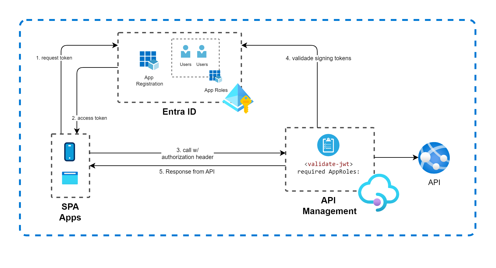
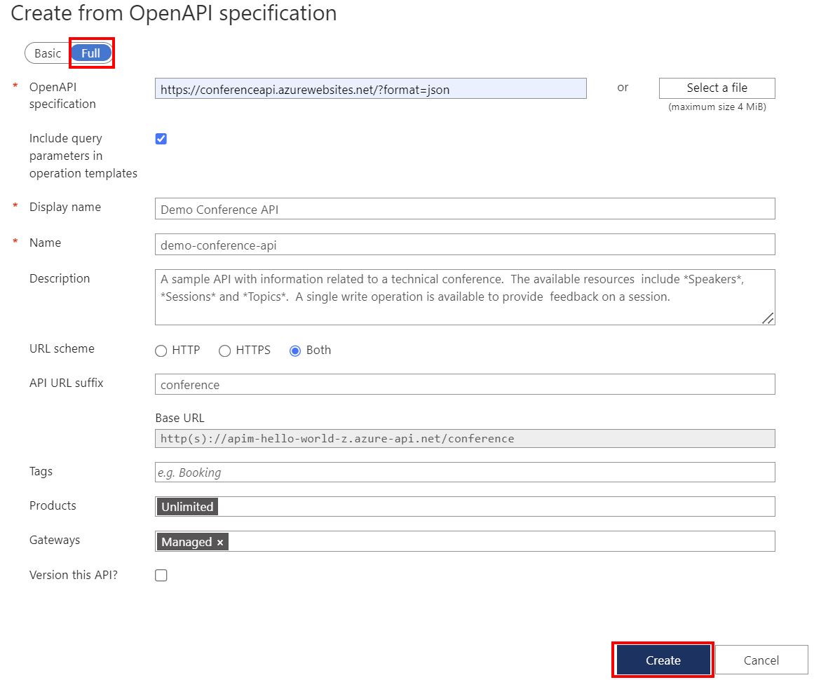
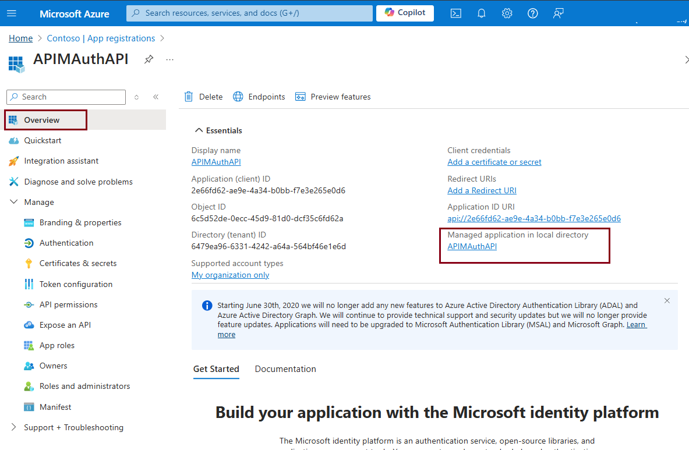
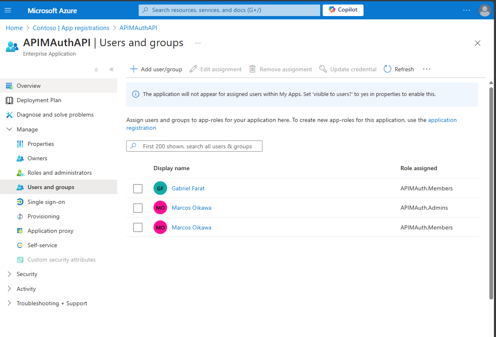
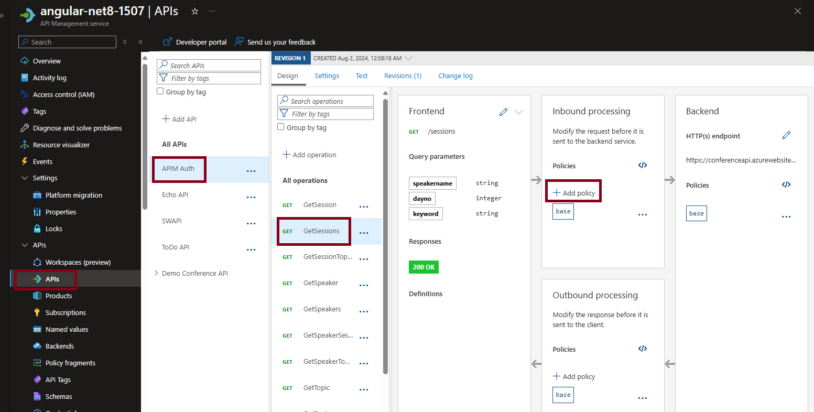
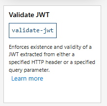

# API Authentication with API Management (APIM) and Entra ID using APIM Policies 

 
 
[](https://azure.microsoft.com)


## Scenario

The main objective of this LAB is to demonstrate how Azure API Management (APIM) can centralized authentication and authorizaton of APIs using Entra ID using APIM Policy (validate-jwt) and App Roles of Entra ID. This is very usefull when you have legacy APIs, APIs with no OAuth 2.0 / OIDC or even if you need to centralized management of authentication and authentication in one single pane of glass


# Prerequisites

- An Azure account with an active subscription. [Create an account for free](https://azure.microsoft.com/free/?WT.mc_id=A261C142F).

## Create APIM Environment
Open Azure Portal and click on Cloud Shell to run this scripts to Create API Management

Variable block
```bash
let "randomIdentifier=$RANDOM"
resourceGroup="apim-auth"
apim="apim-auth-$randomIdentifier"
```

Create Resource Group
```bash
az group create \
    --name $resourceGroup \
    --location brazilsouth
```

Ceate an API Management
```bash
az apim create --name $apim --resource-group $resourceGroup \
  --publisher-name Contoso --publisher-email admin@contoso.com \
  --no-wait
```

## Import an API in APIM
For this demo, we will use Confere API (https://conferenceapi.azurewebsites.net), a backend API for demos proposed, provided by Microsoft. Use this guide [Tutorial: Import and publish your first API](https://learn.microsoft.com/en-us/azure/api-management/import-and-publish) for more details if need to import API to your API Management.


1. In the Azure portal, search for and select API Management services.
1. On the API Management services page, select your API Management instance.
1. In the left navigation of your API Management instance, select APIs.
1. Select the OpenAPI tile.
1. In the Create from OpenAPI specification window, select Full.
1. Enter the values from the following table.
1. You can set API values during creation or later by going to the Settings tab.




|Setting|Value|
|-------|-----|
|**OpenAPI specification**|*https:\//conferenceapi.azurewebsites.net?format=json*|
|**Display name**|After you enter the OpenAPI specification URL, API Management fills out this field based on the JSON.|
|**Name**|After you enter the OpenAPI specification URL, API Management fills out this field based on the JSON.|
|**Products**|**Unlimited**|
|**Gateways**|**Managed**|


## Register the SPA App

1. Navigate to the [Azure portal](https://portal.azure.com) and select the **Azure Active Directory** service.
1. Select the **App Registrations** blade on the left, then select **New registration**.
1. In the **Register an application page** that appears, enter your application's registration information:
    1. In the **Name** section, enter a meaningful application name that will be displayed to users of the app, for example `apim-auth`.
    1. Under **Supported account types**, select **Accounts in this organizational directory only**
    1. Select **Register** to create the application.
1. In the **Overview** blade, find and note the **Application (client) ID**. keep this value for future use.
1. In the app's registration screen, select the **Expose an API** blade to the left to open the page where you can publish the permission as an API for which client applications can obtain [access tokens](https://aka.ms/access-tokens) for. The first thing that we need to do is to declare the unique [resource](https://docs.microsoft.com/azure/active-directory/develop/v2-oauth2-auth-code-flow) URI that the clients will be using to obtain access tokens for this API. To declare an resource URI(Application ID URI), follow the following steps:
    1. Select **Set** next to the **Application ID URI** to generate a URI that is unique for this app.
    1. For this sample, accept the proposed Application ID URI (`api://{clientId}`) by selecting **Save**. Read more about Application ID URI at [Validation differences by supported account types \(signInAudience\)](https://docs.microsoft.com/azure/active-directory/develop/supported-accounts-validation).

##### Publish Delegated Permissions

1. All APIs must publish a minimum of one [scope](https://docs.microsoft.com/azure/active-directory/develop/v2-oauth2-auth-code-flow#request-an-authorization-code), also called [Delegated Permission](https://docs.microsoft.com/azure/active-directory/develop/v2-permissions-and-consent#permission-types), for the client's to obtain an access token for a *user* successfully. To publish a scope, follow these steps:
1. Select **Add a scope** button open the **Add a scope** screen and Enter the values as indicated below:
    1. For **Scope name**, enter **APIMAuth.Read** (case-sensitive).
    1. Select **Admins and users** options for **Who can consent?**.
    1. For **Admin consent display name** type in the details, `e.g. Allow the users of the app apim-auth to read data`.
    1. For **Admin consent description** type in the details `e.g. Allows the app apim-auth to read the signed-in users data.`
    1. For **User consent display name** type in the details `e.g. Read data items as yourself`.
    1. For **User consent description** type in the details `e.g. Allow the app apim-auth to read data on your behalf.`
    1. Keep **State** as **Enabled**.
    1. Select the **Add scope** button on the bottom to save this scope.
    > Repeat the steps above for another scope named **APIMAuth.ReadWrite**
1. Select the **Manifest** blade on the left.
    1. Set `accessTokenAcceptedVersion` property to **2**.
    1. Select on **Save**.

> :information_source:  Follow  [the principle of least privilege](https://docs.microsoft.com/azure/active-directory/develop/secure-least-privileged-access) whenever you are publishing permissions for a web API.

## Create App Roles
[App Roles](https://docs.microsoft.com/azure/active-directory/develop/howto-add-app-roles-in-azure-ad-apps#assign-app-roles-to-applications) is the core of RBAC for APIs. We will create two App Roles, one representing "Member Access", and other one representing "Admin" access.

1. Still on the same app registration, select the **App Roles** blade to the left.
1. Select **Create app role**:
    1. For **Display name**, enter a suitable name for your application permission, for instance **APIMAuth.Members**.
    1. For **Allowed member types**, choose **Both (Users/Groups + Applications)** 
    1. For **Value**, enter **APIMAuth.Members** (case-sensitive).
    1. For **Description**, enter **Allow users to access members permissions of API, whicth is Can list only sessions**.
    1. Select **Apply** to save your changes.
    > Repeat the steps above for another app permission named **APIMAuth.Admins**, changing description to **Allow users to access admin permissions of API, whicth is can list all sessions and speakers**

## Giving users permissions
Next, we will assign users to preview created App Roles.
1. Still on App Registration pane, on overview, click on "Managed application in local directory", to go to the Enterprise Application pane.

1. In the Enterprise Pane, go to **Users and groups**, **+ Add user/group**, select a user and select just APIM.Members App Role. Click on Select, and then Assign.
1. Do the seme for another user, including this time, the APIM.Admins and APIM.Members App Role. The configuration will be something similar to this:

In this example, Marcos will have the "Admin" role, and Gabriel will have "Member" role.

## Configure APIM According App Roles
In this sample, we will consider that Members can list the sessions, but not list the Speakers. to do so, we will configure 2 operations policies, one for GetSessions operation, and another one for GetSpeakers operation.


1. In Azure Portal, go to API Management, click on instance created.
1. In the left panel, go to API, click on API imported, GetSessions operation. In Inbound policy, click on **+ Add policy**.

1. Select "Validade JWT" Policy

1. Fill the values with values of application, described in the table:

|Setting|Value|
|-------|-----|
|**Header name**|Authorization|
|**Failed validation HTTP code**| Leave with 401 - Unauthorized|
|**Failed validation error message**| Unauthorized due APIM Policy |
|**Audiences**|**api://[your-app-id]**|
|**Required claims - Name**|**roles**|
|**Required claims - Match**|**Any claim**|
|**Required claims - Value**|**APIMAuth.Members**|
|**Open ID URLs** |**"https://login.microsoftonline.com/[your-tenant-id]/v2.0/.well-known/openid-configuration"**|

1. Click Save.

> check the values In the Entra ID / App Registration Pane, on the "Endpoints" Icon (right to the "+ New registration" button)

1. Open the policy and add the issuer xml section, below to audiences section

```xml
    <issuers>
        <issuer>https://sts.windows.net/[your-tenant-id]/</issuer>
    </issuers>
```


2. Repeat the process with GetSpeakers, using **APIMAuth.Admins** Role.


## Next steps


## Learn more

## Contributing

This project welcomes contributions and suggestions.  Most contributions require you to agree to a
Contributor License Agreement (CLA) declaring that you have the right to, and actually do, grant us
the rights to use your contribution. For details, visit https://cla.opensource.microsoft.com.

When you submit a pull request, a CLA bot will automatically determine whether you need to provide
a CLA and decorate the PR appropriately (e.g., status check, comment). Simply follow the instructions
provided by the bot. You will only need to do this once across all repos using our CLA.

This project has adopted the [Microsoft Open Source Code of Conduct](https://opensource.microsoft.com/codeofconduct/).
For more information see the [Code of Conduct FAQ](https://opensource.microsoft.com/codeofconduct/faq/) or
contact [opencode@microsoft.com](mailto:opencode@microsoft.com) with any additional questions or comments.

## Trademarks

This project may contain trademarks or logos for projects, products, or services. Authorized use of Microsoft 
trademarks or logos is subject to and must follow 
[Microsoft's Trademark & Brand Guidelines](https://www.microsoft.com/en-us/legal/intellectualproperty/trademarks/usage/general).
Use of Microsoft trademarks or logos in modified versions of this project must not cause confusion or imply Microsoft sponsorship.
Any use of third-party trademarks or logos are subject to those third-party's policies.